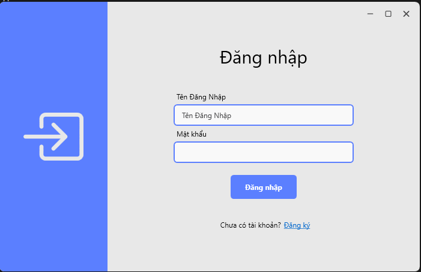
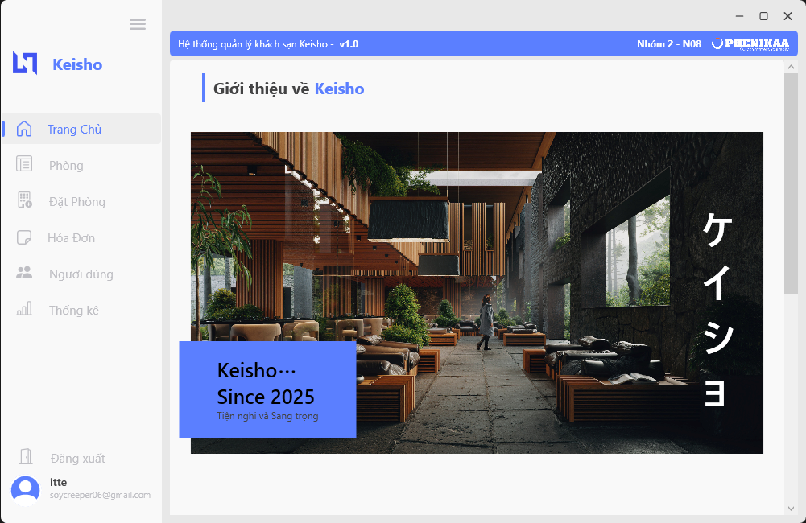
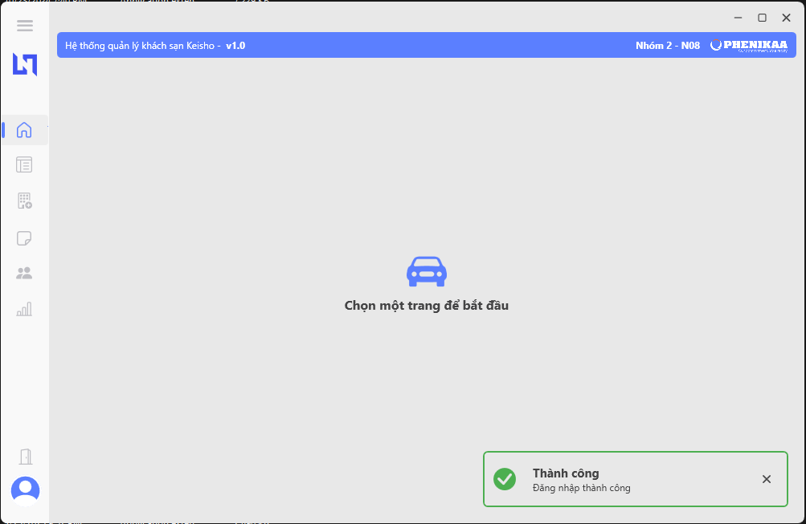
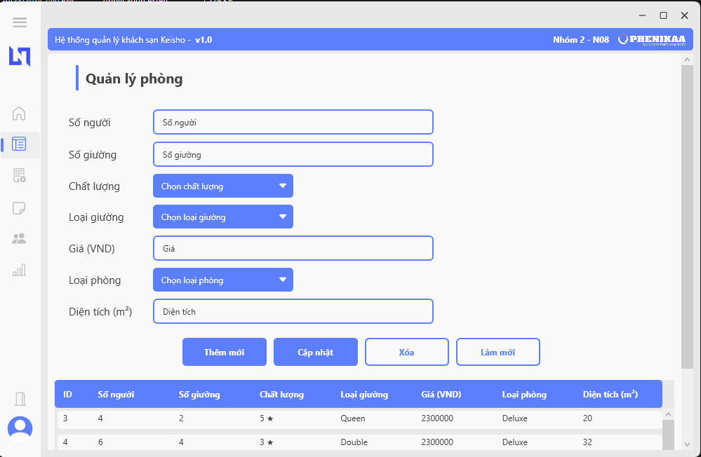
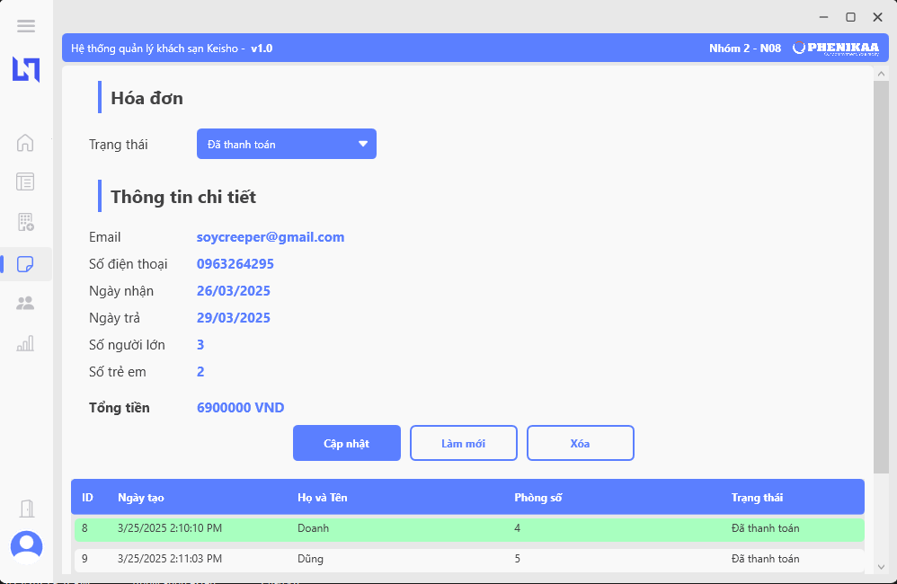
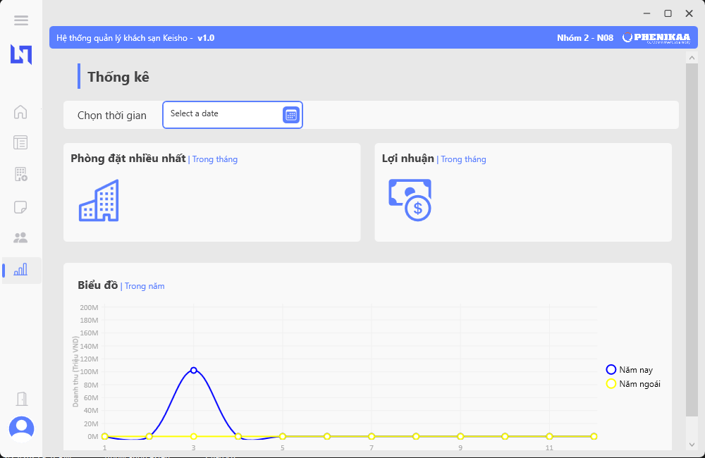

# Hotel Management Application

## **Overview**
This is the .NET implementation of the hotel management system, called Keisho.

## **Features**
- **Room Management:**
  - CRUD operations for rooms (Create, Read, Update, Delete)
  - Room availability status
  - Price calculation for each room

- **Booking Management:**
  - Create and manage reservations
  - Check-in and check-out functionality
  - Payment processing

- **Staff Management:**
  - Manage staff profiles and roles

- **Reporting:**
  - Generate reports for bookings, occupancy, and revenue

## **Technologies Used**
- **Programming Language:** C# .NET
- **Framework:** Entity Framework
- **Database:** SQL Server
- **UI Framework:** WPF (Windows Presentation Foundation)
- **Others: [BCrypt](https://bitbucket.org/vadim/bcrypt.net), [LiveCharts.Wpf](https://v0.lvcharts.com), [MahApps.Metro.IconPacks](https://github.com/MahApps/MahApps.Metro.IconPacks)

## **Screenshots**

  

  

  

  

  

  

## **Future Improvements**
- Online booking integration
- Automated email notifications
- Enhanced reporting with data visualization

---

**Developed by Sothanhtra**

>This is .NET project at Phenikaa University

